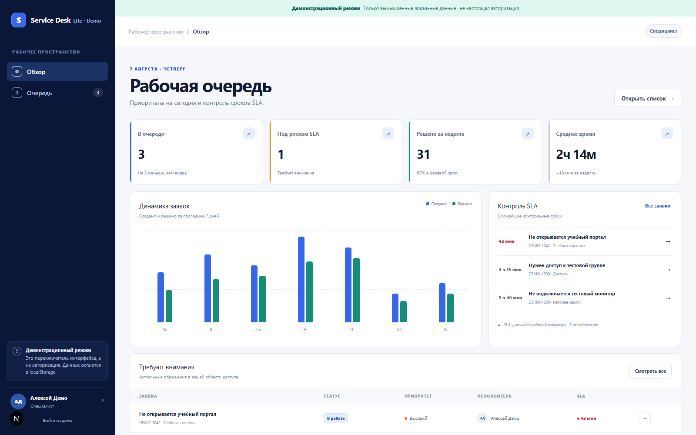
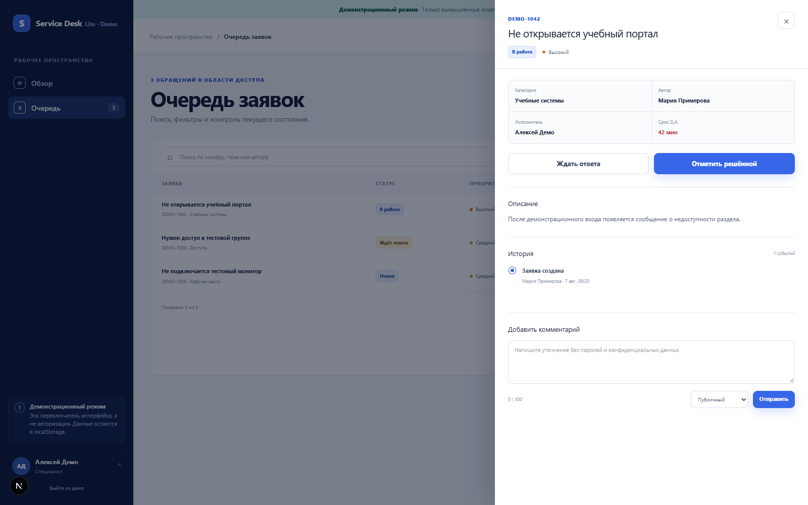
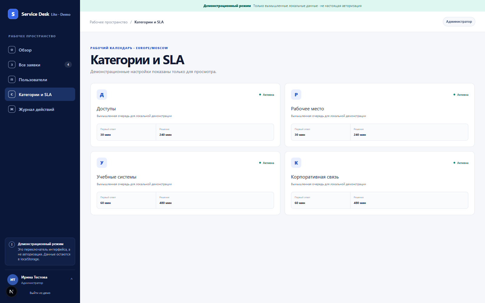

# Service Desk Lite

Веб-система для регистрации и обработки внутренних обращений: от создания заявки до контроля сроков, решения и аудита действий. Проект показывает полный путь от бизнес-требований и ролевой модели до работающего интерфейса, API и политик доступа к данным.

[Открыть работающую версию](https://service-desk-bay.vercel.app/)



## Задача проекта

Внутренней службе поддержки нужен единый процесс, в котором пользователь видит только свои обращения, специалист работает только с назначенными ему категориями, а администратор управляет пользователями, очередями и нормативами SLA.

Решение включает три отдельных рабочих пространства, жизненный цикл заявки, контроль приближения к SLA, историю изменений и защиту от доступа к чужим обращениям по прямой ссылке.

## Результат

- пользователь создаёт заявку и отслеживает её состояние;
- специалист получает очередь разрешённых категорий, берёт обращения в работу и фиксирует решение;
- администратор управляет ролями, категориями, SLA и просматривает аудит;
- сроки рассчитываются по рабочему календарю и часовому поясу;
- права проверяются не только в интерфейсе, но также в API и PostgreSQL RLS;
- демонстрационный режим позволяет изучить продукт без внешних аккаунтов и настоящих данных.

## Галерея

| Работа специалиста | Настройки администратора |
| --- | --- |
|  |  |

## Ключевые сценарии

- создание и редактирование новой заявки;
- назначение специалиста и переходы между допустимыми статусами;
- публичные и внутренние комментарии;
- очереди специалистов по назначенным категориям;
- настройка нормативов SLA и рабочего календаря;
- аудит входов, смены ролей и административных изменений;
- безопасный отказ в доступе к чужим заявкам.

## Модель доступа

| Операция | Пользователь | Специалист | Администратор |
| --- | --- | --- | --- |
| Читать заявку | Только свою | Только разрешённые категории | Любую |
| Создать заявку | Да | Нет | Нет |
| Изменить заявку | Свою новую | Назначенную себе | Нет |
| Комментировать | Свою, публично | Публично или внутренне | Нет |
| Управлять ролями, SLA и очередями | Нет | Нет | Да |

Проверка прав выполняется на маршруте, в серверном слое доступа и политиками базы данных. Клиентское меню не считается средством авторизации.

## Технические решения

- `Next.js 16`, `React 19`, `TypeScript`, `Tailwind CSS`;
- Auth0 для аутентификации и управления сессией;
- PostgreSQL / Supabase с Row Level Security;
- серверная Zod-валидация, CSRF-токены и rate limit;
- Content Security Policy и безопасные HTTP-заголовки;
- SQL-миграции и транзакционные pgTAP-тесты политик доступа;
- демонстрационный режим на вымышленных данных.

## Проверки качества

Проект проходит линтинг, проверку типов, сборку и 23 автоматических теста. Тесты покрывают владение заявкой, границы очередей, административные операции, некорректный ввод, CSRF и отсутствие серверных секретов в клиентском коде.

```bash
npm run lint
npm run typecheck
npm test
npm run security:check
npm run build
```

## Локальная демонстрация

Требуется Node.js `>=22.13.0`.

```powershell
Copy-Item .env.example .env.local
$env:DEMO_MODE = "true"
npm install
npm run dev
```

Откройте `http://localhost:3000` и выберите роль пользователя, специалиста или администратора. Демо использует только вымышленные записи и хранит изменения локально в браузере.

Для полноценной конфигурации нужны проекты Auth0 и Supabase; перечень переменных находится в `.env.example`, а схема базы — в `supabase/migrations`.

## Известные ограничения

- нет файловых вложений и уведомлений;
- праздничный календарь требует наполнения перед production;
- фоновые эскалации SLA не реализованы;
- Auth0, Supabase, backup/PITR и WAF требуют отдельной настройки провайдеров.

Проект создан в учебных целях. В репозитории и демонстрации нет реальных обращений, персональных данных или материалов компаний.
